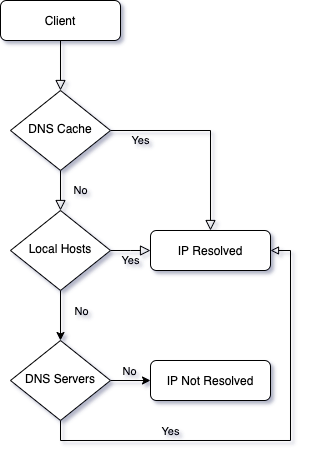
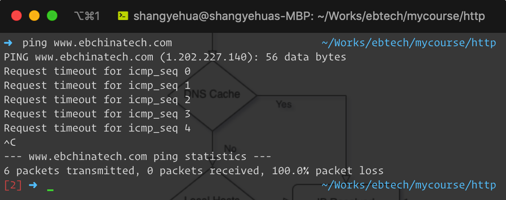
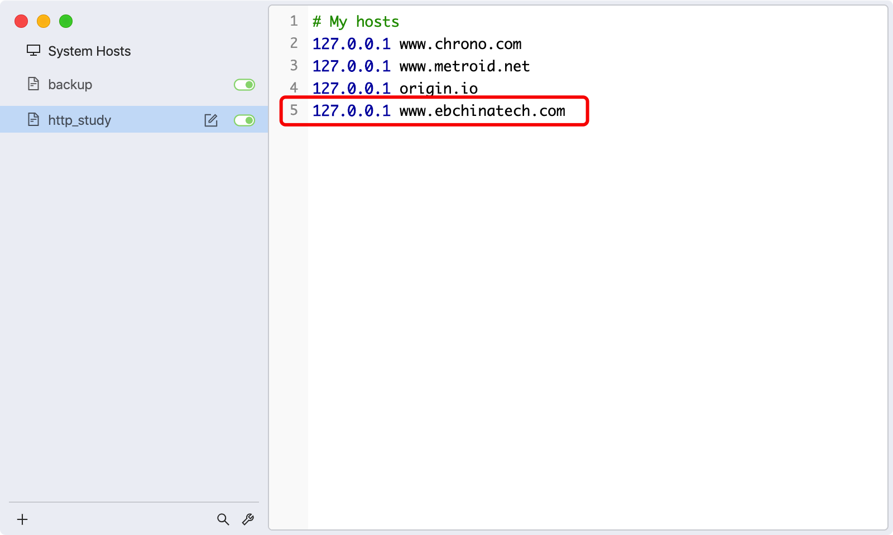
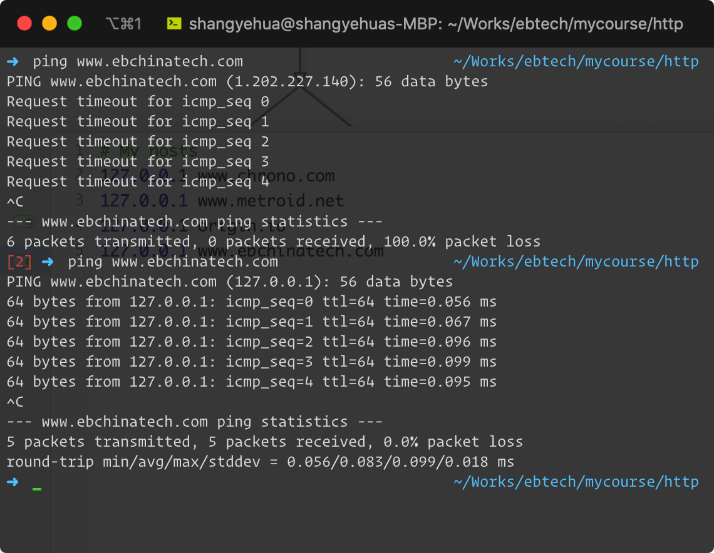
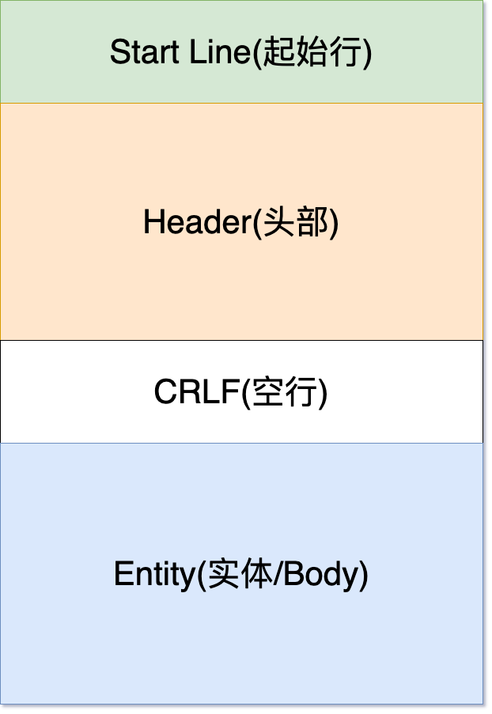
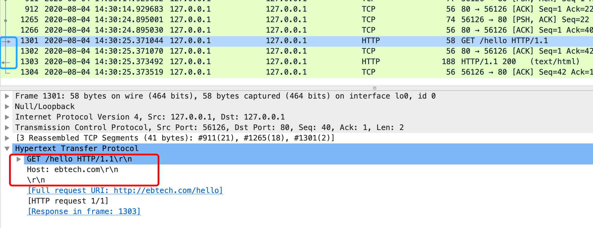
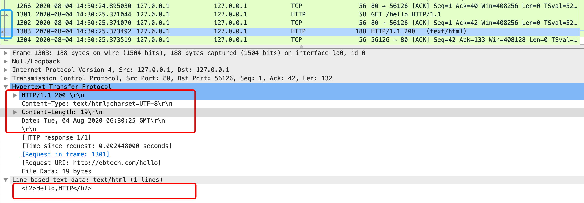

## 一、 HTTP是什么

​		HTTP 通常翻译为“超文本传输协议”，也就是 <b>H</b>yper<b>T</b>ext <b>T</b>ransfer <b>P</b>rotocol。HTTP协议本身位于应用层，不具备“传输”的作用，所以对于“Transfer”的翻译是有争议的。目前HTTP的主流应用方案是通过TCP/IP协议簇进行传输，HTTP本身更多关注的是信息本身，关于翻译和HTTP的定位问题，可以参考这个话题： [关于HTTP中文翻译的讨论](https://www.ituring.com.cn/article/1817) 。

​		首先，HTTP是一种协议，协议是对参与者的一种行为约定和规范。HTTP不是一种具体的技术实现，而是一整套完善的约定和规范，实现了HTTP协议的应用，就可以用作web服务器，比如Apache、Nginx、Tomcat、IIS等。

​		其次，HTTP 协议是一个“双向协议”。也就是说，有两个最基本的参与者 A 和 B，从 A 开始到 B 结束，数据在 A 和 B 之间双向而不是单向流动。通常我们把先发起传输动作的 A 叫做请求方，把后接到传输的 B 叫做应答方或者响应方。数据虽然是在 A 和 B 之间传输，但并没有限制只有 A 和 B 这两个角色，允许中间有“中转”或者“接力”。常用的代理服务器，负载均衡（反向代理）服务器，微服务中的“网关”，都属于“中转站”的角色。

​		最后，HTTP协议的内容是超文本。所谓“超文本”，就是“超越了普通文本的文本”，它是文字、图片、音频和视频等的混合体，最关键的是含有“超链接”，能够从一个“超文本”跳跃到另一个“超文本”，形成复杂的非线性、网状的结构关系。对于“超文本”，我们最熟悉的就应该是 HTML 了，它本身只是纯文字文件，但内部用很多标签定义了对图片、音频、视频等的链接，再经过浏览器的解释，呈现在我们面前的就是一个含有多种视听信息的页面。

## 二、 关于域名

​		HTTP 协议运行在 TCP/IP 上，IP 协议的职责是“网际互连”，它在 MAC 层之上，使用 IP 地址把 MAC 编号转换成了四位数字（IPv4），这就对物理网卡的 MAC 地址做了一层抽象。但是IP 地址“对人不友好”，虽然比 MAC 的 16 进制数要好一点，但还是难于记忆和输入。在 IP 地址之上再一次抽象，把数字形式的 IP 地址转换成有意义容易识别的字符串，就是DNS 域名系统。

​		域名是一个有层次的结构，是一串用“.”分隔的多个单词，最右边的被称为“顶级域名”，然后是“二级域名”，层级关系向左依次降低。最左边的是主机名，通常用来表明主机的用途，比如“www”表示提供万维网服务、“mail”表示提供邮件服务，不过这也不是绝对的，名字的一个重要目的是容易识别和记忆。

​		比如`www.ebchinatech.com`，“com”是顶级域名，“ebchinatech”是二级域名，“www”则是主机名。使用这个域名，DNS 就会把它转换成相应的 IP 地址。

​		域名解析成IP的示意图：

以`www.ebchinatech.com`为例，使用`ping`命令，获取的结果如下：

​		将本地host进行如下修改：

再次执行`ping`命令，结果如下：

## 三 、HTTP的结构

HTTP 协议的请求报文和响应报文的结构基本相同，由三大部分组成：

- 起始行（start line）：描述请求或响应的基本信息；

- 头部字段集合（header）：使用 key-value 形式更详细地说明报文；

- 消息正文（entity）：实际传输的数据，它不一定是纯文本，可以是图片、视频等二进制数据。

这其中前两部分起始行和头部字段经常又合称为“**请求头**”或“**响应头**”，消息正文又称为“**实体**”，但与“**header**”对应，很多时候就直接称为“**body**”。

HTTP 协议规定报文必须有 header，但可以没有 body，而且在 header 之后必须要有一个“**空行**”，也就是“**CRLF**”，十六进制的“**0D0A**”。所以，一个完整的 HTTP 报文就像是下图的这个样子：

## 四、 HTTP报文

### 4.1 请求行

使用Chrome浏览器，发送一个Get请求，打开开发者工具，可以看到浏览器生成的HTTP信息如下：

红色框标注的，就是**请求行**，可以看到，它有三部分组成:

1. 请求方法：是一个动词，如 GET/POST，表示对资源的操作；
2. 请求目标：通常是一个 URI，标记了请求方法要操作的资源；
3. 版本号：表示报文使用的 HTTP 协议版本。

这三个部分通常使用空格（space）来分隔，最后要用 CRLF 换行表示结束。

### 4.2 状态行

和请求行相对于，服务器响应的报文第一行，叫做**状态行**。同样也是由三部分构成：

1. 版本号：表示报文使用的 HTTP 协议版本；
2. 状态码：一个三位数，用代码的形式表示处理的结果，比如 200 是成功，500 是服务器错误；
3. 原因(可选)：作为数字状态码补充，是更详细的解释文字，帮助人理解原因。

使用Telnet工具和Wireshark抓取HTTP通信过程，截图如下：

使用Wireshark抓取的请求内容如下：

响应内容如下：

### 4.3 头部字段

#### 4.3.1 头部结构

请求头和响应头的结构是基本一样的，唯一的区别是起始行。它们的结构分别如下：

头部字段是 key-value 的形式，key 和 value 之间用“:”分隔，最后用 CRLF 换行表示字段结束。使用头字段需要注意下面几点：

- 字段名不区分大小写，例如“Host”也可以写成“host”，但首字母大写的可读性更好；

- 字段名里不允许出现空格，可以使用连字符“-”，但不能使用下划线“_”。

  例如，“test-name”是合法的字段名，而“test name”“test_name”是不正确的字段名；

- 字段名后面必须紧接着“:”，不能有空格，而“:”后的字段值前可以有多个空格；
- 字段的顺序是没有意义的，可以任意排列不影响语义；字段原则上不能重复，除非这个字段本身的语义允许，例如 Set-Cookie。

比如下图，在Field Name和“:”之间，多加一个空格，请求会出现错误，截图如下：

#### 4.3.2 头部使用场景

许多安全技术都使用了特定的Header，比如OAuth2，Basic认证等。下面以Basic认证为例，演示Header的一个使用场景。

将应用开启Basic认证，如果使用浏览器直接访问，会出现以下的对话框：

Basic凭证的使用方式为

Header中添加Authorization字段，格式为：`Authorization: <type> <credentials>`，其中：

- type类型为“Basic”
- credentials (凭证)，是通过将“用户名:密码”格式的字符串经过的Base64编码得到

应用使用的测试用户名为 httpbase，密码为secret，经过Base64编码后值为: aHR0cGJhc2U6c2VjcmV0

使用telnet，直接请求，结果如下：

添加Authorization之后，结果如下：

### 4.4 实体

#### 4.4.1 MIME

早在 HTTP 协议诞生之前，在电子邮件系统里的，为了让电子邮件可以发送 ASCII 码以外的任意数据，制定了一个方案，名字叫做“多用途互联网邮件扩展”（Multipurpose Internet Mail Extensions），简称为 MIME。MIME 把数据分成了八大类，每个大类下再细分出多个子类，形式是“type/subtype”的字符串。这种形式刚好也符合了 HTTP 明文的特点，所以HTTP 取了其中的一部分，用来标记 body 的数据类型，这就是我们平常总能听到的“MIME type”。

这里简单列举一下在 HTTP 里经常遇到的几个类别：

- text：即文本格式的可读数据，我们最熟悉的应该就是 text/html 了，表示超文本文档，此外还有纯文本 text/plain、样式表 text/css 等。

- image：即图像文件，有 image/gif、image/jpeg、image/png 等。

- audio/video：音频和视频数据，例如 audio/mpeg、video/mp4 等。

- application：数据格式不固定，可能是文本也可能是二进制，必须由上层应用程序来解释。

  常见的有 application/json，application/javascript、application/pdf 等，如果不知道数据是什么类型，可以用 application/octet-stream，即二进制数据。

#### 4.4.2 Encoding type

仅有 MIME type 还不够，因为 HTTP 在传输时为了节约带宽，有时候还会压缩数据，使用“Encoding type”，告诉数据是用的什么编码格式，这样对方才能正确解压缩，还原出原始的数据。Encoding type 常用的只有下面三种：

- gzip：GNU zip 压缩格式，也是互联网上最流行的压缩格式；
- deflate：zlib（deflate）压缩格式，流行程度仅次于 gzip；
- br：一种专门为 HTTP 优化的新压缩算法（Brotli）。

#### 4.4.3 常见请求实体数据

GET请求在RFC规范中Entity是未规定的，[参阅: GET规范](https://www.w3.org/Protocols/rfc2616/rfc2616-sec9.html#sec9.3)。并且在某些情况下，GET请求会局部退化，允许缓存等，所以通常的做法是GET不使用Entity。比如POSTMAN早期版本GET请求不允许添加body。下面将使用POSTMAN和Wireshark，观察不同的body的报文格式。

下面以POST请求为例，PUT和PATCH报文的结构是类似的。

- x-www-form-urlencoded格式，在网页上，form如果使用POST提交，没有指定body格式时，默认是此类型，不能上传文件。

使用Wireshark抓取的报文

- multipart/form-data，支持文件上传

  

使用Wireshark抓取的报文

完整报文如下:

## 五、 HTTP/2

在“语义”上保持稳定，HTTP/2 在“语法”层做了“天翻地覆”的改造，完全变更了 HTTP 报文的传输格式。针对HTTP/1.1，在以下几个方面做了优化

- 头部压缩

  由于报文 Header 一般会携带“User Agent”“Cookie”“Accept”“Server”等许多固定的头字段，多达几百字节甚至上千字节，但 Body 却经常只有几十字节（比如 GET 请求、204/301/304 响应），成了不折不扣的头重脚轻。更严重的是，成千上万的请求响应报文里有很多字段值都是重复的，非常浪费，“长尾效应”导致大量带宽消耗在了这些冗余度极高的数据上。所以，HTTP/2 把“头部压缩”作为性能改进的一个重点，不过 HTTP/2 并没有使用传统的压缩算法，而是开发了专门的“HPACK”算法，在客户端和服务器两端建立“字典”，用索引号表示重复的字符串，还釆用哈夫曼编码来压缩整数和字符串，可以达到 50%~90% 的高压缩率。

- 二进制格式

  HTTP/2 不再使用可见的 ASCII 码，而是向下层的 TCP/IP 协议“靠拢”，全面采用二进制格式。这样虽然对人不友好，但却大大方便了计算机的解析。使用纯文本的时候容易出现多义性，比如大小写、空白字符、回车换行、多字少字等等，程序在处理时必须用复杂的状态机，效率低。而二进制里只有“0”和“1”，可以严格规定字段大小、顺序、标志位等格式，解析起来没有歧义，实现简单，而且体积小、速度快，做到“内部提效”。

  它把 TCP 协议的部分特性挪到了应用层，把原来的“Header+Body”的消息“打散”为数个小片的二进制“帧”（Frame），用“HEADERS”帧存放头数据、“DATA”帧存放实体数据。这种做法有点像是“Chunked”分块编码的方式，但 HTTP/2 数据分帧后“Header+Body”的报文结构就完全消失了，协议看到的只是一个个的“碎片”。

- 虚拟的“流”

  HTTP/2 定义了一个“流”（Stream）的概念，它是二进制帧的双向传输序列，同一个消息往返的帧会分配一个唯一的流 ID。你可以把它想象成是一个虚拟的“数据流”，在里面流动的是一串有先后顺序的数据帧，这些数据帧按照次序组装起来就是 HTTP/1 里的请求报文和响应报文。

  因为“流”是虚拟的，实际上并不存在，所以 HTTP/2 就可以在一个 TCP 连接上用“流”同时发送多个“碎片化”的消息，这就是常说的“多路复用”（ Multiplexing）——多个往返通信都复用一个连接来处理。

  在“流”的层面上看，消息是一些有序的“帧”序列，而在“连接”的层面上看，消息却是乱序收发的“帧”。多个请求 / 响应之间没有了顺序关系，不需要排队等待，也就不会再出现“队头阻塞”问题，降低了延迟，大幅度提高了连接的利用率。

## 六、 总结

1. HTTP的含义，可以参考话题： [关于HTTP中文翻译的讨论](https://www.ituring.com.cn/article/1817) 。

2. 域名解析

   分析了域名的解析过程，利用域名解析的过程，可以实现定制化域名解析。利用这个特点，可以搭建一套不依赖于IP的分布式应用。

3. HTTP结构

   HTTP是纯文本的协议，结构简单，可读性强，对人和机器都足够友好，这也是得以广泛应用的主要原因。

4. HTTP报文

   HTTP报文语义直观，结构简洁。头部字段可定制化程度非常高，许多技术，都是借助HEADER来实现的，比如OAuth2，缓存等。

5. HTTP/2

   HTTP/2全文使用二进制编码，传输效率得到极大提升。同时由于“流”的引入，可以实现“多路复用”，避免了“队头阻塞”问题。同时由于机制的变化，一些针对HTTP/1的方式，可能会出现“负作用”，比如HTTP/1通过域名分散来实现多线程加载的方式，不能充分发挥“多路复用”的优点，域名收敛才是更好的优化方式。